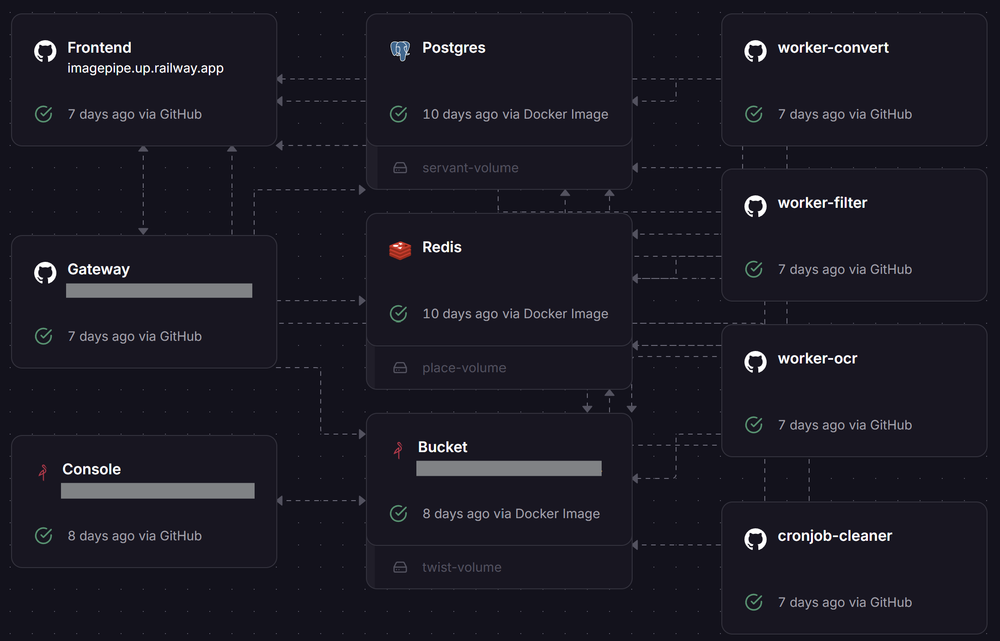

# Developer Notes: ImagePipe Architecture
A technical summary on building ImagePipe — documenting its structure, deployment, and what I learned along the way.

## 🧱 Architecture
- **Frontend**: React-based SPA served by Nginx as reverse proxy
- **Gateway**: Flask app exposing REST APIs and dispatching Celery tasks
- **Workers**: 'convert', 'filter', and 'ocr' tasks
- **Cleaner (cronjob-cleaner, also a Worker)**: regularly removes expired files from MinIO and records from Postgres
- **Redis**: Message broker for Celery
- **Postgres**: Task metadata store
- **MinIO**: S3-compatible object storage

🧩 **Components**  
  

🚄 **Railway Deployment**  
  

🔄 **Data Flow**  

## ✅ Project Strengths
- Modular and extensible design
- Fully asynchronous and loosely coupled
- Presigned URL architecture decouples download logic
- CronJobs for cleanup
- Easy to extend with new worker types

## 🎯 Limitations & TODOs
- Docker🐳 ✅docker-compose ❌test passed (branch: local/docker)
- CI/CD: one-command deployment
- Add authentication
- Remove minikube ✅yaml ✅secret & Ingress ❌self-hosting ❌ just learning not necessary

## Other Details & thoughts
- Logging usage
- To simplify json response
- Considering abstract and standarized class